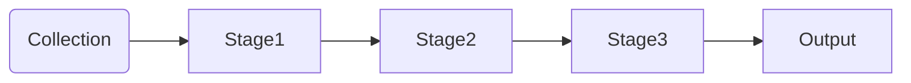

# Aggregation Framework 
Allows us run various types of reports and analysis in documents in one or more MongoDB collections.

We take input from a MongoDB collection and pass the documents through _1 or more_ stages. Each of which performs a different operation on its inputs.

## Operations
#### match
#### project
#### sort
#### skip
#### limit

testing change...

test1

test2

test3