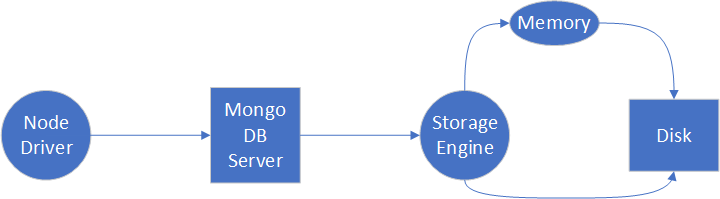

# Indexes

## New in Mongo 3.0 
Pluggable storage engines

*All Documents, indexes, metadata data are written to disk by the storage engine. 
The storage engine is also making decisions about what data to hold in memory and what to commit to disk*

Storage Engine options:
* MMAP
* Wired Tiger

## MMAPv1

MMAP is the default `Mongo` storage engine and it attempts to allocate disk size in virtual memory (VM) so that storage is set aside for DB use. So DB data is then held by storage engine in the VM, any data not in VM has to be accessed from disk.

MMAP offers:
* Collection level locking (multiple reader single writer lock)
* In place updates (updates document in memory)
* Power of two sizes (if document update is 3 bytes, 4 is allocated. If its 7 bytes, 8 is allocated, 19 then 32 is allocated.)

## Wired Tiger

Wired Tiger offers:
* Document level concurrency (as opposed to MMAP collection level locking)
    * Documents aren't locked rather its assumed the application will not write to the same document concurrenty.
* Management of its own storage
* No in place update

## Indexes
If you do a search on a collection without and index you will end up querying the entire collection. 

If using MMAP, an index will use a BTree to store the indexes and speed up the searches.

