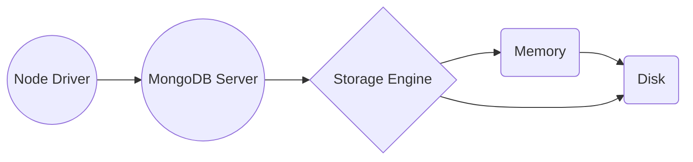

#Indexes

##New in Mongo 3.0 
Pluggable storage engines

*All Documents, indexes, metadata data are written to disk by the storage engine. 
The storage engine is also making decisions about what data to hold in memory and what to commit to disk*

