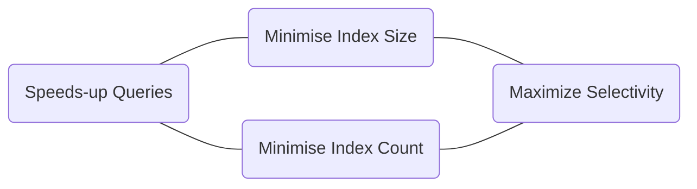

# Indexing

Rather than having Mongo look up every document in a collection a much more efficient means of querying a collection is to use an index. This will result in less memory and less disk IO being used when executing a search. 

If you do not explicitly state an index, Mongo will leverage the _id field as an indexed field. The below query returns a list of all the indexes that exist for this DB:
>db.system.indexes.find()

If you are interested in seeing the indexes for a specific collection, the below query also works:
>`db.<collectionName>.getIndexes()`

## createIndex
>`db.<collectionName>.createIndex({<fieldName>: direction})`

## ensureIndex
>`db.<collectionName>.ensureIndex({<fieldName>: direction})`

This command will create an index on a collection (if it doesn't yet exist) <BR>*AND*<BR> create a collection if it doesn't exist.

Sample below:
>db.messages.ensureIndex({time:1})

This command will ensure an index is created for the time field in ascending order. The response from Mongo should appear similar to: 
```
{
	"createdCollectionAutomatically": true|false,
	"numIndexesBefore": number,
	"numIndexesBefore": number,
	"note: string, //e.g. "all indexes already exist"
	"ok: number
}
```

## dropIndex
If you wish to remove an index e.g. created in error
>`db.<collectionName>.dropIndex('<indexName>')`
>

## explain
The explain function show the query plan used for a given query.
>db.messages.find({_id: "abc"}).explain()

The results of the query will look similar to the below:
```
{
        "queryPlanner" : {
                "plannerVersion" : 1,
                "namespace" : "test.messages",
                "indexFilterSet" : false,
                "parsedQuery" : {
                        "$_id" : {
                                 "$eq" : "abc"
                                 }
                },
                "winningPlan" : {
                        "stage" : "IDHACK",
                },
                "rejectedPlans" : [ ]
        },
        "serverInfo" : {
                "host" : "server",
                "port" : 27017,
                "version" : "3.0.7",
                "gitVersion" : "6ce7cbe8c6b899552dadd907604559806aa2e9bd"
        },
        "ok" : 1
}
```

#### Results explained: 
>stage: "IDHACK" 

This tells us that the special id index strategy was used to pick up documents for this query.

>stage: "COLLSCAN" 

This tells us that the entire collection was scanned in order to pick up documents for this query. **Warning:** Queries that rely on this type of scan will chew up resources.

>stage: "IXSCAN" 

This tells us that that an index scan was used to complete the query. 

### executionStats
If we wish to see more details in terms of a queries performance, we can pass the executionStats parameter to the explain function.
>db.messages.find({_id: "abc"}).explain('executionStats')
* `totalDocsExamined` This field details the number of documents that were loaded from disk and scanned in order to complete the query.
* `nReturned` This field details the number of documents that matched the query's criteria.

## Sparse Index

One way to minimize the amount of storage for documents that have rarely populated data elements is to use a sparse index e.g. 
>`db.<collectionName>.ensureIndex({<fieldName>: direction},{sparse:true})`

## Unique
If we have a field in the collection that should be unique we can apply a unique index to that field. This will ensure no other document contains the same field value and enforces uniqueness within a single collection (not across shards).
>`db.<collectionName>.ensureIndex({<fieldName>: direction},{unique:true})`
A unique index will work on both single value fields as well as on arrays.

## Sparse AND Unique
Unique will be enforced when value exists, meaning null values are allowed in multiple docs, missing fields are allowed in multiple docs. 	
>`db.<collectionName>.ensureIndex({<fieldName>: direction},{unique:true, sparse: true})`

## TTL
In order to ensure data retention rules are applied in your collection, a TTL (time to live) index is used by Mongo to determine the number of seconds a document should be retained. Once a certain TTL is reached, Mongo will deem documents to have expired and the document will be subject to automatic removal. **Note:** Only one TTL index is allowed per collection, and a TTL index must be defined on a date-time field.

>`db.<collectionName>.ensureIndex({<fieldName>: direction},{expireAfterSeconds: number})`

## Index Quality

How do we measure the quality of an index? 
- If Mongo has to make a choice in terms of which index to use? Mongo then has to evaluate the selectivity of an index, to figure out which index has the potential to minimize the amount of work required.

*Info:* Mongo may get the index choice wrong for a given query, so to assist you should consider the following:

*`Compound indexes` - By having more than one key the combine selectivity increases, can help serve more than one query (query/sort operations. By having fewer indexes covering your queries you can experience a performance gain because less space is required and it can take less time to process and update indexes as docs are being written. 



## Background vs Foreground

By default indexes are created in the foreground. This is an action which will block any write commands. However a background index creation would allow for updates to be made. How could this be done? If we use a replica set, one server could have an index applied at a time.
>`db.<collectionName>.createIndex({<fieldName>: direction},{background:true})`
