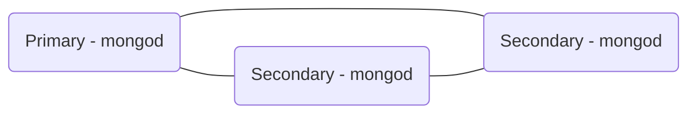

# Replica Sets



>A replica set is a group of mongod servers working together, each server having a copy of the data. The same data. 

All members talk to each other to ensure health and configuration of the members. One server is the designated primary, it is the only one you can write data to. Secondaries are not writable however you can read data from them.

If the primary server were to fail, another server will then step in to become the new primary.

## Capped Collection

A capped collection / fixed size collection sees documents added *sequentially* . When the last document inserted reaches the limit of the fixed size collection it is wraps around the collection and is inserted at the beginning of the collection (overwriting the first document).
Why this approach? 
* Mongo can pre-allocate a file to hold the collection, and it will never need to grow (or shrink) that file. This has a real positive benefit at runtime as Mongo will never has to wait for the OS to allocate more space.
* Means adding documents is really fast as documents are always written at the position immediately following the previous one (where the file pointer is already).

In a replica set, any writes are done via the primary server and saved into the *oplog*. The secondary servers will then pull these commands sequentially from the oplog and apply the changes to themselves.

The secondaries uses a *tail* command to open a cursor on the *oplog* file and they then process the next command as it comes.

## Getting started

>start mongod --dbpath fresh --replSet r1 --oplogSize 1

The above command starts a new window with the mongod process, a DB path of fresh is specified where we create a replica set called r1 and we specify the oplog file size of 1MB.

**Note:** The default oplog file size is 5% of the available disk space on the current drive, but no larger than 50GB.

If we issue the above command, we will find that the mongod process reports and error stating that further configuration is required to run the replica set.

Within the mongo shell, issuing the below command will make a replica set.
>rs.initiate()

To view the replica set's configuration, issue the following command:
>var cfg = rs.config()
```java
{
   "_id" : "r1",	//the name of the replica set per our command above
   "version" : 1,	//allows mongo servers identify the latest version of the configs
   "members" : [	//an array of all replica set members
      {
         "_id" : 0,
         "host" : "myserver:27017",
         "arbiterOnly" : false,
         "buildIndexes" : true,
         "hidden" : false,	//when true means not considered for primary
         "priority" : 1,	//0 is a special value for hidden members
         "tags" : {
         },
         "slaveDelay" : NumberLong(0),
         "votes" : 1
      },
   ],
   "settings" : {
      "chainingAllowed" : true,
      "heartbeatTimeoutSecs" : 10,
      "getLastErrorModes" : {
      },
      "getLastErrorDefaults" : {
         "w" : 1,
         "wtimeout" : 0
      },
   }
}
```
>rs.reconfig(cfg)

This command will reconfigure the replica set with a given configuration document.

## Runtime status
>rs.status()
This command tells us information relating to the health of a given replica set.
```java
{
   "set" : "r1",
   "date" : ISODate("2016-11-02T20:02:16.543Z"),
   "myState" : 1,	//1 is primary
   "members" : [	//an array of status for each member of the RS
      {
            "_id" : 0,
            "name" : "myserver:27017",
            "health" : 1,
            "state" : 1,	//matches myState when node and server are the same
            "stateStr" : "PRIMARY",
            "uptime" : 269,	//how long the server has been up (secs)
            "optime" : {
                        "ts" : Timestamp(1478116934, 1),
                        "t" : NumberLong(1)
            },
            "optimeDate" : ISODate("2016-11-02T20:02:14Z"),
            //optime values detail the time the last operation from the oplog that was applied on this node
            "electionTime" : Timestamp(1478116933, 1),
            "electionDate" : ISODate("2016-11-02T20:02:13Z"),
            //election fields detail the last time an election was held
            "configVersion" : 1,
            "self" : true	//true when we are connected to that member
      }
   ],
   "ok" : 1,
   "operationTime" : Timestamp(1510716515, 1)
}
```

## Elections
To decide which server is primary, mongo will hold an election.	During an election, replica members communicate with each other and cast a vote. For a member to become primary it must receive more than 50% of the votes.

Primary and Secondary servers may vote. **Arbiters** may also vote. Arbiters are different in that they do not hold *any* data.
In the event of a 2 member replica set, we cannot implement automatic failover as in the event server #1 goes down, server #2 cannot get more than 50% of the vote in order to be elected as primary.

**Important:** When an election cannot be complete due to server unavailability, all servers remain in their existing roles. This may allow for data retrieval for example when the primary server shuts down, but no documents could be inserted or modified while the primary is unavailable and and election pending.

Mongo v3 allows up to 7 voting members in a replica set. But a quorum must be reached in order to have an election. In the event the number of servers drops below the quorum, the primary will step down and there will be no primary.

|  Replica Set Size   |Quorum        |Unavailable|
|----------------|------------------|------------|
|1|1|0|
|2|2|0|
|3|2|1|
|4|3|1|
|5|3|2|
|6|4|2|
|7|4|3|

## A more complex replica set

>start mongod --port 30001 --dbpath `<server1 filePath>` --replSet r1
>start mongod --port 30002 --dbpath `<server2 filePath>` --replSet r1
>start mongod --port 30003 --dbpath `<server3 filePath>` --replSet r1

In the above example we start 3 instances of mongod, each one within the r1 replica set, each one with a unique port number and 3 separate filePaths/directories.

Note: To connect to a specific instance with mongo shell, you simply need to specify the port number as below:
>mongo --port 30001

*Note:* In this example you still need to initiate the replica set with `rs.initiate()`

### rs.add()
In order to add a server to the replica set we can use `rs.add()` similar to below:
>rs.add("myserver:30002")

If we want to add a server as an arbiter:
>rs.add("myserver:30003", true)

### Swapping from one server to another
If we find that we are logged onto one server at the command prompt similar to below:
>r1:PRIMARY>

We can switch to another server by simply using the connect shell function:
>db = connect("myserver:30002/test")

## Priority 
Nodes can be given preferred treatment when it comes to elections. When setting a higher priority for a given server, after bringing this server online mongo will force a re-election and assign Primary status over the remaining servers.

### Step Down
In order to allow a primary server transition privilege (relinquish control) to another server we can issue a step down command 
>rs.stepDown()

The default time associated with a stepDown command if 60 seconds. You may change this value however as below:
>rs.stepDown(3*60)

In this example we stepDown the server for 3 minutes.

*Note:* After stepDown a new election will take place! 

### Freeze
It may be the case that you wish to prevent a server becoming Primary for a length of time. To achieve that we would use the freeze command.
>rs.freeze(5*60)


## Network Partition
Concerns include which servers are online, where the primary is located etc.

### Chaining
This is a practice that controls how data flows internally within a replica set. It can yield large saving when in a cloud status and across multiple data centers e.g. different continents.