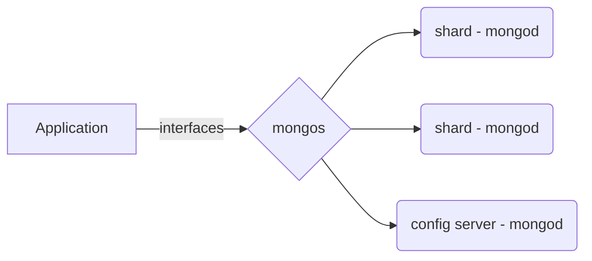
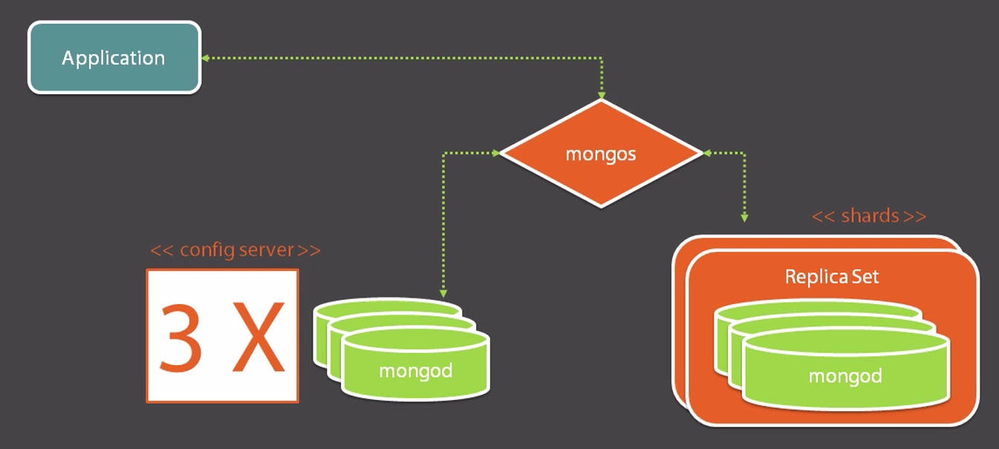

# Sharding

When you need massive scale...you need a sharding strategy. It is a means of distributing both work and data, so that further work over data can be performed.

The sharding concept is quite simple, you take a collection, split it up over several servers, each server is the home for a subset of the documents in that collection. Thus a single document resides in one of the servers, it is never split up.

What tells us where the specific data resides? A config server holds and manages this information. This configuration defines a shard, that itself holds part of the collection.

How this is achieved is by setting key bounds for the collection similar to below:
|Key Range Lower|Key Range Higher|Shard|
|---------------|----------------|-----|
|0<=   |<1000    |A|
|1000<=|<2000    |B|
|2000<=|<Infinity|C|

## mongos
Knowing that the config server will detail where the data is held, we still have a concern as to how the clients will know where to look to find a specific document(s). Also there are issues with queries that may pull documents from different/many shards. How can this be managed? The answer is with `mongos`.

`mongos` is the router for all your application's commands, sitting between the application and the shards. It will consult the config servers to figure out how the command should be routed and will issue commands to the shard servers on your application's behalf.

The below diagram gives an overview of the topology here:

## Configuration Server
>start mongod --configsvr --dbpath `<confingServerFilePath>`

This command will start the config server's mongod instance, by passing the arg configsvr we are instructing that this server should not be used for any other purpose.

## Starting the `mongos` instance
>start mongos -configdb `<hostname>`

### Start shard instances
>start mongod --port `<portNumber>` --dbpath `<shardServerFilePath>`

### Adding Stand-alone Shards
Firstly we open the `mongo` shell to access the `mongos` instance. Once we are connected to that server we should issues a command similar to below:
>sh.addShard('`<hostName>`:`<portNumber>`')

This should result in a response similar to:
`{ "shardAdded" : "shard0000",  "ok" : 1 }`

#### Status
>sh.status()

The above command will allow for a status to be shown for the shards associated with the `mongos` instance.

## Databases and Collections
With sharding you have to opt-in specific collections in a specifi database that you want to shard. This is because not all your collections have so much data or transactions that will require you to use sharding.

>sh.enableSharding('`<databaseName>`')

*Note:* Collections that are not sharded will reside on the primary shard.

>sh.shardCollection('`<databaseName>.<collectionName>`', { '`fieldName`':`1|-1`} )

For the fieldName we specify ascending or descending???

## Production Topology

### Configuration Server Availability

**In production run exactly 3 config servers**

How that can be achieved? Using a command as below we can call out the 3 servers to be used:
>start mongos -configdb `<hostname1>,<hostName2>,<hostName3>`

These configuration servers should be accessible from the rest of cluster servers, so any server names should be recognized and resolved via DNS, host config entries etc.

### Durability
In production, each shard should be a replica set. We've only added a stand-alone shard previously? So how to achieve this?

>sh.addShard('`<replicaSetName>`/`<hostName>`:`<portNumber>`')

As above we need to provide the replica set name, specifying the replica set member and port number. This command should also find any associated members within that replica set and also add those.

## Picking a shard key
Issues to be aware of before sharding:
* Once a collection has been sharded, it can't be unsharded.
* Once a key has been selected, you can't change that key.
* Once a document has been written, and contains a value in the shard key fields these values cannot be changed.
* If shards are unbalanced, the shard with more documents will have to work harder than the others. The reason to shard is to distribute work evenly.

### Chunks
Once defined shard keys are used internally to define *chunks*, `mongos` will then seek to manage the chunks across the shard servers and configuration server(s). This will take time to complete.

### Hashing
A hashed shard key, can only be used for a single field and helps to evenly distribute documents across shards.
>sh.shardCollection('`<databaseName>.<collectionName>`', { '`fieldName`':`hashed`} )

While hashes will ensure a more even distribution of data across shards, this will result in a loss of locality where data cannot be queried as efficiently as it could have been if it all existed in one shard.

#### A Good Key
The choice of a sharding key is crucial and difficult, and there isn't really one right answer in how to choose. The scenario needs to be understood and analyzed, and the below are guidelines that need to be considered.
* Your access pattern
* Theoretical granularity
* Actual granularity
* Experiment

## Tag-Aware
To add a tag to a shard server we just need to use the shard name and the tag value e.g.
>sh.addShardTag('`<existingShardName>`','`<tagValue>`')

Once a tag is in place we need to define the range of keys to be associated with each tag.	 Creating the tag range definition:
- Defines a range associated with the tag
- Use only when connected to `mongos`
- Helps balancer automatically assign chunks to desired shards.
>sh.addTagRange("`<databaseName>`.`<collectionName>`", {`<fieldName>`:"`<keyValue1>`"}, {`<fieldName>`:"`<keyValue2>`"},"`<tagValue>`")

**Note:** The lower bound is inclusive, the upper bound is exclusive.

*Information:* If you were looking to define an absolute upper bound or an absolute lower bound the MaxKey and MinKey keywords are what you need to use.

## Shard or Not?

Sharding is very powerful and allows teams to scale massively. But not every installation of Mongo needs sharding.

### Complexity
Like with replica sets, sharding will require additional server instances, a minimum of 3 servers immediately multiplied by the number of shards you wish to have, then we need 3 config servers and some `mongos` servers. The operational complexity therefore increases significantly, to manage that many servers and maintain a disaster recovery plan.
### Infrastructure Cost
Do you really need this?
### When should I?
Its too late when performance degrades dramatically.	Such as if Mongo's working set doesn't fit into memory. A single shard should be able to comfortably take the workload. Before you approach that limit its time to add a new shard. Each shard should have sufficient storage to facilitate repair operations.	

**Note:** If we choose the wrong shard key, the only way to proceed is to create a new collection and migrate the data across. This is pretty intricate work and would need to be planned.